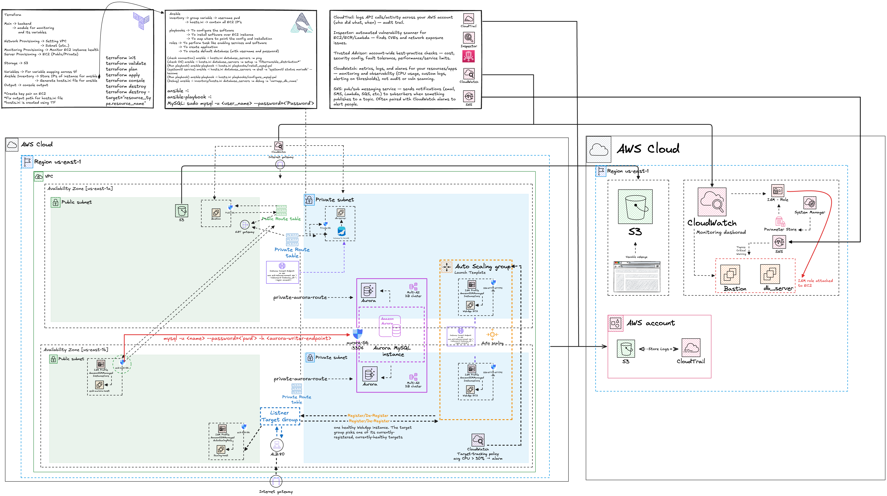

# core

The foundation stack: a VPC with public and private subnets across two availability zones, a bastion + private EC2 pair, monitoring, and logging. Every other stack in this repo either reads its outputs or ignores it entirely. That is why `core` must be applied first, and destroyed last.

---

## What you'll learn

- **What actually makes a subnet public** — a route to an internet gateway
- **Bastion pattern** — reaching a private instance without giving it a public IP
- **EC2 Instance Connect endpoints** — the modern alternative to a bastion
- **Child modules vs separate stacks** — `monitoring/` and `security/` are called with `module{}` and share this state `scaling/` and `rds/` are separate stacks that only *read* it
- **Outputs as an interface** — 9 of the 13 outputs exist purely so other stacks can consume them

## What's implemented

- VPC `192.168.0.0/22`, 4 subnets (public + private × 2 AZs), IGW, 2 route tables
- 5 security groups, including two consumed by the `rds` stack
- 2 × `t3.micro` EC2 — a public bastion and a private instance
- EC2 Instance Connect endpoint for the private subnet
- CloudWatch agent config delivered via SSM Parameter Store
- `monitoring/` module — 6 alarms, a dashboard, SNS email alerts
- `security/` module — CloudTrail, Inspector, Trusted Advisor
- 2 S3 buckets — CloudTrail logs, and a static website

---

## Architecture

<details>
<summary>Click to expand</summary>



</details>

---

## Prerequisites

Everything in [PREREQUISITES.md](../../PREREQUISITES.md), plus:

| | |
|---|---|
| **`infra/bootstrap` applied** | this stack stores state in the bucket it creates |
| **An EC2 key pair named `your-key-pair`** | EC2 → Key Pairs → Create. Or change `var.key_pair`. Apply fails without it. |
| **Your public IP** | Terraform prompts for `my_ip`. It is the only thing allowed to SSH in. |

**Region: `us-east-1`.** Hardcoded in the provider, and `var.ami` is a region-specific AMI ID. Everything in this repo assumes `us-east-1` — using another region means changing both.

---

## Run it

```bash
cd infra/core

cp backend.lab.hcl.example backend.lab.hcl
# edit one line: the bucket name you invented in infra/bootstrap

terraform init -backend-config=backend.lab.hcl
terraform apply
```

`backend.lab.hcl` is gitignored — it names a bucket in *your* account. Commit
the real one and everybody cloning this repo runs `init` against a bucket they
have no access to, and gets `AccessDenied`.

Terraform prompts for one value:

```
var.my_ip
  What is your current public IP from your ISP?:

  Enter a value: 84.1.2.3/32        ← note the /32
```

```bash
curl -s ifconfig.me    # your current IP
```

Your ISP changes this. When SSH stops working after a few days, that's why re-run `apply` with the new value.

To stop the prompt, put it in `terraform.tfvars` (gitignored):

```hcl
my_ip       = "84.1.2.3/32"
alert_email = "you@example.com"
```

### Two defaults you should change

```hcl
# variables.tf
alert_email = "temp_email@temp.email.com"   # SNS sends alarm mail here
key_pair    = "your-key-pair"                # must exist in your account
```

`alert_email` has a placeholder default. Set a real one in `terraform.tfvars`.

### Check it

```bash
terraform output ec2_public_url
terraform output website_endpoint
terraform output monitoring_dashboard_url
```

---

## How it's wired

### Inside this stack

```
core (one state file)
 ├── module "monitoring"   ./monitoring/   shares this state
 └── module "security"     ./security/     shares this state
```

Both are **child modules** — called with `module{}`, no backend of their own, destroyed when `core` is destroyed.

### Outward — what other stacks read

```
core                  outputs                        consumed by
────                  ───────                        ───────────
VPC + subnets    →    vpc_id, public/private × 2AZ  →  scaling, rds
security groups  →    allow_ssh_sg_id                  scaling
                      private_instance_sg_id           scaling
                      ec2_host_sg_id                   rds
                      aurora_sg_id                     rds
```

### The private subnet has no internet — on purpose

The NAT Gateway is commented out in `network_provisioning.tf`, so `private-rtb` has no `0.0.0.0/0` route. A NAT Gateway is roughly **$32/month before a byte of traffic**

Consequences to be aware of:

- The private EC2's `user_data` installs the CloudWatch agent with `dnf`. With
  no route out, that install fails, so the private instance reports no
  memory/disk metrics.
- Anything else needing outbound internet from a private subnet won't work.

**If you want it**, uncomment the `aws_eip`, `aws_nat_gateway` and `aws_route`
blocks in `network_provisioning.tf` and re-apply. Watch the cost.

---

## Teardown

```bash
# destroy anything that reads core FIRST
cd infra/rds      && terraform destroy
cd ../scaling     && terraform destroy

# then core
cd ../core        && terraform destroy
```

Destroying `core` while `scaling` or `rds` still exist leaves them pointing at
a VPC and security groups that are gone. Their next `plan` will be nonsense.

`force_destroy = true` on both S3 buckets, so their contents go without a
prompt. That's deliberate for a lab and wrong anywhere else.

---

## Cost

| | |
|---|---|
| 2 × `t3.micro` EC2 | ~$0.50/day |
| EBS volumes | a few cents/day |
| CloudWatch alarms | 10 free, then ~$0.10 each/month |
| S3, SNS, CloudTrail (first trail) | pennies |
| **NAT Gateway if you enable it** | **~$32/month** — the one that hurts |

Roughly **$0.60/day** as shipped. Unlike `ecs-fargate` there is no cheap teardown story here: the EC2 instances bill while they exist, so destroy the stack when you're done for the day.

> Prices change and vary by region. Check the
> [AWS pricing calculator](https://calculator.aws) — these numbers are a
> reference point, not a quote.
