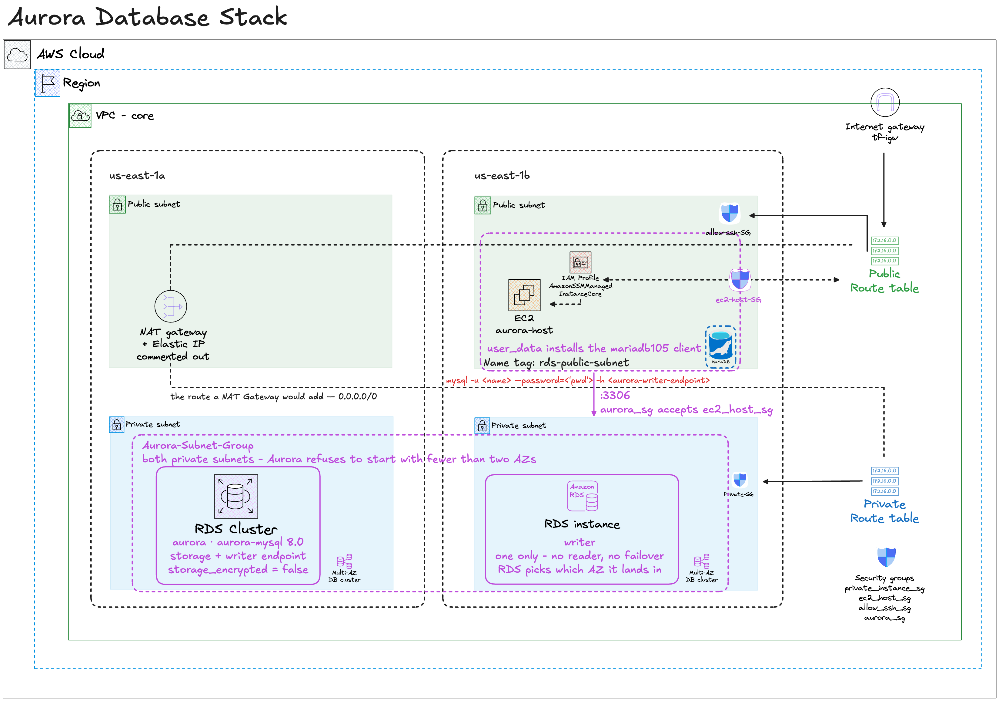
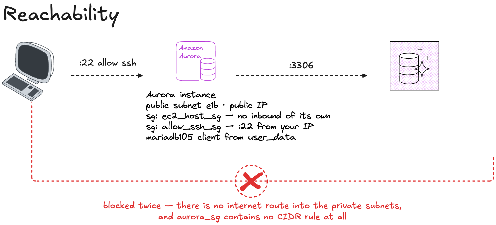

# rds

An Aurora MySQL cluster in `core`'s private subnets, reachable only from a client host in a public subnet.

---

## What you'll learn

- **Aurora's split** — a cluster is storage and an endpoint; the instance is compute
- **DB subnet groups** — why a database needs two AZs before it will start
- **Reachability by security group, not by network** — the database has no public IP and no internet route
- **Secrets out of Terraform** — the password comes from a gitignored file, never the repo
- **Reading another stack's state** — `terraform_remote_state`

## What's implemented

- Aurora MySQL cluster spanning two private subnets, one `db.t3.medium` instance
- DB subnet group across `us-east-1a` and `us-east-1b`
- A `t3.micro` client host in a public subnet with the `mariadb105` CLI installed
- IAM role and instance profile with SSM access
- Output: the cluster's writer endpoint

---

## Architecture

<details>
<summary>Click to expand</summary>



</details>

## Reachability Concept

<details>
<summary>Click to expand</summary>



</details>


---

## Prerequisites

| | |
|---|---|
| `infra/bootstrap` applied | this stack's state lives in that bucket |
| `infra/core` applied | it reads core's private subnets and `aurora_sg` |
| An EC2 key pair | [PREREQUISITES.md §5](../../PREREQUISITES.md) |
| An account with Aurora MySQL | not every sandbox account has it — check below |

```bash
aws rds describe-db-engine-versions --engine aurora-mysql --region us-east-1 \
  --query 'DBEngineVersions[-1].EngineVersion' --output text
```

Nothing back means Aurora isn't available to you, and `apply` will fail.

---

## Run it

```bash
cd infra/rds

cp backend.lab.hcl.example backend.lab.hcl
cp terraform.tfvars.example terraform.tfvars
# edit both: your state bucket, and a password you choose

terraform init -backend-config=backend.lab.hcl
terraform apply
```

**~10 minutes.** Aurora is the slowest thing in this repo to create.

### The password

`db_master_password` has no default, so `apply` fails rather than falling back to something weak. It goes in `terraform.tfvars`, which is gitignored:

```hcl
db_master_password = "something-you-choose"
```

Or as an environment variable, which Terraform picks up automatically:

```bash
export TF_VAR_db_master_password='...'
```

Either way it stays out of git. It does end up in Terraform **state**, which is why that S3 bucket is encrypted and private.

> For anything real, use `manage_master_user_password = true` instead: RDS
> generates the password, stores it in Secrets Manager and rotates it, and
> Terraform never sees the value.

### Connect to it

The cluster has no public IP and no internet route. You reach it from the client host, which is the only thing `aurora_sg` admits:

```bash
ssh -i ~/.ssh/your-key-pair.pem ec2-user@<client-host-public-ip>

mysql -h <writer-endpoint> -u admin -p
```

```bash
terraform output aurora_writer_endpoint
```

---

## How it's wired

This stack creates no networking. It borrows it from `core`:

```
core's state  ──read──▶  rds
  private_subnet × 2       DB subnet group
  public_subnet_e1b        client host
  aurora_sg                the cluster — port 3306 from ec2_host_sg only
  ec2_host_sg              client host
  allow_ssh_sg             client host
```

The path in is a chain, and every link is a security group:

```
your IP ──:22──▶ client host ──:3306──▶ Aurora
         allow_ssh_sg          aurora_sg accepts ec2_host_sg, nothing else
```

Own state file, own lock:

```
core/terraform.tfstate     owned by core
rds/terraform.tfstate      owned by this stack
```

---

## Decisions you should know about

| | |
|---|---|
| `storage_encrypted = false` | a finding in any real review. It is off because it **cannot be toggled on an existing cluster** — enabling it forces a replacement. Turn it on the day this stops being a lab. |
| `skip_final_snapshot = true` | `destroy` takes the data with it, no snapshot. Correct for a lab rebuilt constantly, wrong anywhere data matters. |
| `monitoring_interval = 0` | Enhanced Monitoring off — it bills per instance. |
| One instance, not two | a real cluster runs a writer and a reader in different AZs. One is cheaper and demonstrates the same objects. |

---

## Teardown

```bash
terraform destroy
```

~5 minutes. `skip_final_snapshot = true` means the data is gone with no snapshot to restore from.

Destroy this **before** `core` — it reads core's subnets and security groups, and destroying core first leaves this stack pointing at things that no longer exist.

---

## Cost

| | |
|---|---|
| Aurora `db.t3.medium` | ~$1.70/day |
| Aurora storage + I/O | pennies at this size |
| `t3.micro` client host | ~$0.25/day |

Roughly **$2/day** — the most expensive stack in this repo, and the one to
destroy first when you stop for the day.

> Prices change and vary by region. Check the
> [AWS pricing calculator](https://calculator.aws) — these are a reference
> point, not a quote.
